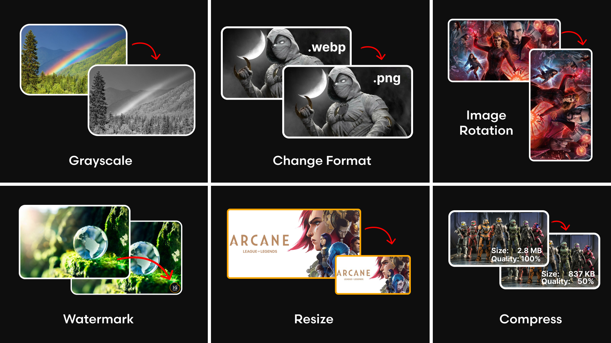

## Python Image Processing Code Snippets

Collection of Python code snippets for image processing, manipulation and computer vision.

## Installation

```
$ pip install -r requirements.txt
```

## Content Table

| S. No | Code                           |
| ----- | ------------------------------ |
| 01    | [GrayScale][grayscale]         |
| 02    | [Change Format][change_format] |
| 03    | [Watermark][composite]         |
| 04    | [Resize][resize]               |
| 05    | [Thumbnail][thumbnail]         |
| 06    | [Compress][compress]           |
| 07    | [Image Rotation][rotate]       |
| 08    | [Blur][blur]                   |

## Preview



[grayscale]: https://github.com/hicodersofficial/py-img-proc-snippets/blob/main/grayscale.py
[change_format]: https://github.com/hicodersofficial/py-img-proc-snippets/blob/main/change_format.py
[composite]: https://github.com/hicodersofficial/py-img-proc-snippets/blob/main/composition.py
[resize]: https://github.com/hicodersofficial/py-img-proc-snippets/blob/main/resize.py
[thumbnail]: https://github.com/hicodersofficial/py-img-proc-snippets/blob/main/thumbnail.py
[compress]: https://github.com/hicodersofficial/py-img-proc-snippets/blob/main/compress.py
[rotate]: https://github.com/hicodersofficial/py-img-proc-snippets/blob/main/rotate.py
[blur]: https://github.com/hicodersofficial/py-img-proc-snippets/blob/main/blur.py

## Thank You 😍
